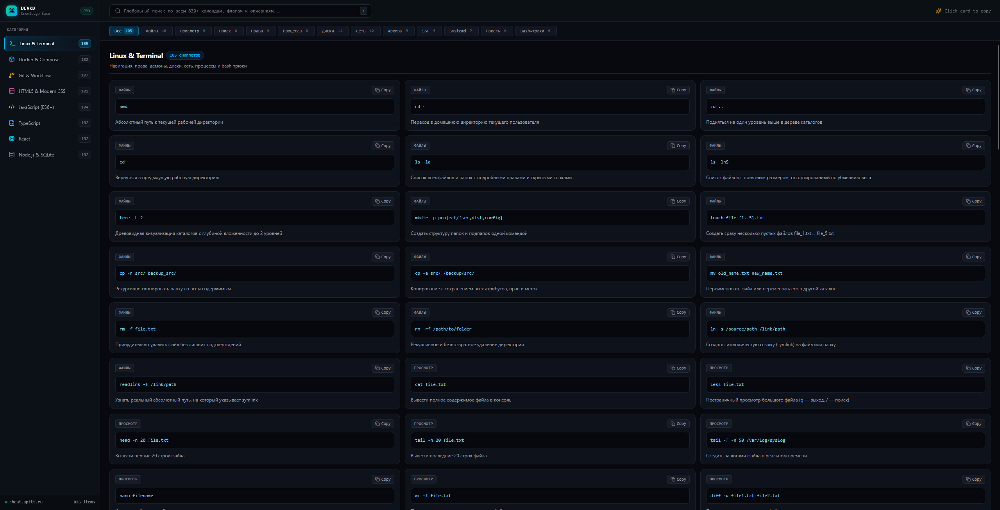

<div align="center">

# ⚡ DevKB — Modern Developer Knowledge Base

**Интерактивная база знаний и быстрая шпаргалка для разработчиков.**  
Более 830+ отборных команд, современных CSS-трюков, хуков React, паттернов TypeScript и рецептов по Docker и Linux.

[](./LICENSE)
[](#-запуск-через-docker)
[](https://react.dev/)
[](https://www.typescriptlang.org/)
[](https://vitejs.dev/)
[](https://tailwindcss.com/)

<br />



</div>

---

## 🎯 Особенности

- 🔍 **Мгновенный глобальный поиск:** поиск по ключевым словам, флагам команд и описаниям без задержек.
- ⌨️ **Быстрый фокус:** нажми `/` в любом месте приложения, чтобы сразу перейти в строку поиска (и `Esc` для очистки).
- 📋 **One-Click Copy:** копирование команды или сниппета прямо в буфер кликом по карточке.
- 🏷️ **Глубокая фильтрация:** разбиение каждой категории на удобные интерактивные подкатегории.
- 🪟 **Инженерный UI в стиле Dark Theme:** трёхколоночная сетка, подсветка синтаксиса и компактная адаптивная вёрстка.
- 🐳 **Готовый Docker-стек:** мультистейдж-сборка (Alpine Nginx) с готовым `docker-compose.yml` для мгновенного селфхостинга.

---

## 📚 Категории базы знаний (830+ сниппетов)

| Категория | Сниппетов | Что внутри |
| :--- | :---: | :--- |
| **🐧 Linux & Terminal** | **105** | Навигация, права, `systemd`, мониторинг (`htop`, `lsof`), диски, сеть и bash-трюки |
| **🐳 Docker & Compose** | **102** | Управление контейнерами, тома, сети, очистка кэша, Healthcheck и docker-compose |
| **🌿 Git & Workflow** | **107** | Ветвление, `rebase`, `cherry-pick`, `reflog`, сброс коммитов и отмена изменений |
| **🎨 HTML5 & Modern CSS** | **102** | Modern Flexbox/Grid, Container Queries, `field-sizing`, эффекты и переменные |
| **⚡ JavaScript (ES6+)** | **104** | Промисы, `AbortController`, замыкания, структуры данных `Map`/`Set`, Web API |
| **🔷 TypeScript** | **102** | Дженерики, Utility Types, тайпгарды, темплейтные литералы и Mapped Types |
| **⚛️️ React** | **102** | Базовые и кастомные хуки, мемоизация, React 18/19 Transitions, Suspense и паттерны |
| **🗄️ Node.js & SQLite** | **102** | Express, `better-sqlite3`, WAL-режим, транзакции, JWT, bcrypt, потоки и Zod |

---

## 🚀 Быстрый запуск

### 🐳 Запуск через Docker (Self-Hosted)

Самый быстрый и изолированный способ развернуть приложение на своём сервере или локально:

```bash
# 1. Клонировать репозиторий
cd devkb

# 2. Запустить контейнер
docker compose up -d --build
